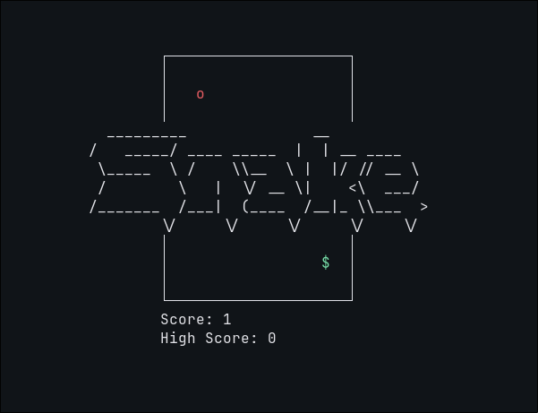

# snake-tui

A basic snake game in c in your terminal.



Took far too long to make.

## Requirements

- A C compiler (`gcc`) and `make`
- A POSIX system — Linux, macOS, BSD, or WSL (uses `termios`/`unistd`, so no native Windows)
- A terminal with UTF-8 and ANSI escape sequence support
- A terminal at least **82 columns by 26 rows** — the board is drawn at a fixed offset, so anything smaller pushes it off-screen

## Build and run

Use make run to run it.

```sh
make run
```

Or build and run separately:

```sh
make            # builds ./snake
./snake
make clean      # removes the binary and build artifacts
```

## Controls

| Key | Action |
| --- | --- |
| `w` / `k` | Up |
| `s` / `j` | Down |
| `a` / `h` | Left |
| `d` / `l` | Right |
| `q` | Quit |

Any direction key dismisses the title screen and starts the game.

## How it plays

Eat the red `o` to grow. Hitting a wall or your own tail resets the snake, and
your best length so far is kept as the high score. The snake moves one cell
every 120 ms.

## High scores

Your best length is saved to `highscore.txt` and loaded again the next time you
play. A few details worth knowing:

- The score is only recorded **on death**. Quitting with `q` mid-run won't save
  it, even if you were on your best run ever.
- The file is created in whatever directory you launch the game from, so
  starting it from somewhere else gives you a separate high score.
- If the file is missing, empty, or edited into nonsense, the high score just
  starts at 0.

Enjoy.
